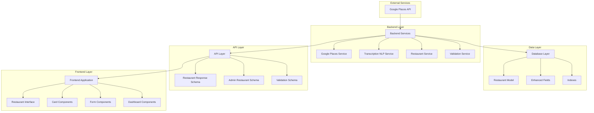

# Restaurant Data Enhancement - Technical Architecture

## 1. Architecture Design



## 2. Technology Stack

### Backend Technologies
- **Framework**: FastAPI (Python 3.11+)
- **Database**: PostgreSQL with SQLAlchemy ORM
- **API Integration**: Google Maps Places API
- **Validation**: Pydantic models
- **Migration**: Alembic
- **Async**: asyncio with AsyncSession

### Frontend Technologies
- **Framework**: Next.js 14 with App Router
- **Language**: TypeScript 5+
- **UI Components**: Shadcn UI
- **Styling**: Tailwind CSS
- **State Management**: React Context/Redux Toolkit
- **API Client**: Axios

### Database Technologies
- **Primary**: PostgreSQL 15+
- **JSON Fields**: PostgreSQL JSONB for flexible opening hours
- **Indexing**: B-tree and GIN indexes for performance
- **Migration**: Alembic for schema versioning

## 3. API Definitions

### 3.1 Enhanced Restaurant Response

```typescript
interface RestaurantResponse {
  id: string;
  name: string;
  slug: string;
  address: string;
  latitude: number;
  longitude: number;
  city?: string;
  country?: string;
  google_place_id?: string;
  google_rating?: number;
  business_status: string;
  photo_url?: string;
  is_active?: boolean;
  created_at: string;
  updated_at: string;
  tags?: TagResponse[];
  cuisines?: CuisineResponse[];
  listings?: ListingLightResponse[];
  
  // Enhanced fields
  current_opening_hours?: OpeningHours;
  secondary_opening_hours?: OpeningHours;
  international_phone_number?: string;
  opening_hours?: OpeningHours;
  price_level?: number;
  website?: string;
}

interface OpeningHours {
  open_now?: boolean;
  weekday_text?: string[];
  periods?: Array<{
    open: {
      day: number;
      time: string;
    };
    close?: {
      day: number;
      time: string;
    };
  }>;
}
```

### 3.2 Admin Restaurant Update Schema

```typescript
interface RestaurantUpdateRequest {
  name?: string;
  address?: string;
  latitude?: number;
  longitude?: number;
  city?: string;
  country?: string;
  google_place_id?: string;
  google_rating?: number;
  business_status?: BusinessStatus;
  photo_url?: string;
  is_active?: boolean;
  
  // Enhanced fields
  current_opening_hours?: OpeningHours;
  secondary_opening_hours?: OpeningHours;
  international_phone_number?: string;
  opening_hours?: OpeningHours;
  price_level?: number;
  website?: string;
}
```

### 3.3 Google Places API Integration

```python
# Request fields for detailed place information
DETAILED_PLACE_FIELDS = [
    'name', 'formatted_address', 'geometry', 'place_id', 'rating',
    'business_status', 'photos', 'formatted_phone_number',
    'international_phone_number', 'opening_hours', 'price_level',
    'website', 'address_components'
]

# Response mapping
def map_google_place_to_restaurant(place_data: dict) -> dict:
    return {
        "name": place_data.get("name"),
        "address": place_data.get("formatted_address"),
        "latitude": place_data["geometry"]["location"]["lat"],
        "longitude": place_data["geometry"]["location"]["lng"],
        "google_place_id": place_data.get("place_id"),
        "google_rating": place_data.get("rating"),
        "business_status": place_data.get("business_status"),
        "photo_url": extract_photo_url(place_data.get("photos", [])),
        
        # Enhanced fields
        "international_phone_number": place_data.get("international_phone_number"),
        "opening_hours": place_data.get("opening_hours"),
        "current_opening_hours": process_current_hours(place_data.get("opening_hours")),
        "secondary_opening_hours": place_data.get("opening_hours", {}).get("secondary_opening_hours"),
        "price_level": place_data.get("price_level"),
        "website": place_data.get("website"),
    }
```

## 4. Database Schema Design

### 4.1 Enhanced Restaurant Table

```sql
CREATE TABLE restaurants (
    id UUID PRIMARY KEY DEFAULT gen_random_uuid(),
    name VARCHAR(255) NOT NULL,
    slug VARCHAR(255) NOT NULL UNIQUE,
    address TEXT NOT NULL,
    latitude FLOAT NOT NULL,
    longitude FLOAT NOT NULL,
    city VARCHAR(100),
    country VARCHAR(100),
    google_place_id VARCHAR(255) UNIQUE,
    google_rating FLOAT,
    business_status VARCHAR(50) NOT NULL,
    photo_url TEXT,
    is_active BOOLEAN DEFAULT true,
    created_at TIMESTAMP WITH TIME ZONE DEFAULT NOW(),
    updated_at TIMESTAMP WITH TIME ZONE DEFAULT NOW(),
    
    -- Enhanced fields
    current_opening_hours JSONB,
    secondary_opening_hours JSONB,
    international_phone_number VARCHAR(50),
    opening_hours JSONB,
    price_level INTEGER CHECK (price_level >= 0 AND price_level <= 4),
    website VARCHAR(500)
);

-- Performance indexes
CREATE INDEX idx_restaurants_phone ON restaurants(international_phone_number) WHERE international_phone_number IS NOT NULL;
CREATE INDEX idx_restaurants_price_level ON restaurants(price_level) WHERE price_level IS NOT NULL;
CREATE INDEX idx_restaurants_website ON restaurants(website) WHERE website IS NOT NULL;
CREATE INDEX idx_restaurants_gin_opening_hours ON restaurants USING GIN(current_opening_hours);
CREATE INDEX idx_restaurants_composite ON restaurants(city, country, price_level, business_status);
```

### 4.2 JSON Schema for Opening Hours

```json
{
  "type": "object",
  "properties": {
    "open_now": {"type": "boolean"},
    "weekday_text": {
      "type": "array",
      "items": {"type": "string"}
    },
    "periods": {
      "type": "array",
      "items": {
        "type": "object",
        "properties": {
          "open": {
            "type": "object",
            "properties": {
              "day": {"type": "integer", "minimum": 0, "maximum": 6},
              "time": {"type": "string", "pattern": "^[0-9]{4}$"}
            },
            "required": ["day", "time"]
          },
          "close": {
            "type": "object",
            "properties": {
              "day": {"type": "integer", "minimum": 0, "maximum": 6},
              "time": {"type": "string", "pattern": "^[0-9]{4}$"}
            }
          }
        },
        "required": ["open"]
      }
    }
  }
}
```

## 5. Service Layer Architecture

### 5.1 Google Places Service

```python
class GooglePlacesService:
    def __init__(self, api_key: str):
        self.client = GoogleMapsClient(key=api_key)
        self.base_url = "https://maps.googleapis.com/maps/api/place"
    
    async def fetch_restaurant_details(self, restaurant_name: str, city: Optional[str] = None, country: str = "USA") -> dict:
        """Fetch enhanced restaurant details from Google Places API."""
        # Implementation with retry logic and error handling
        pass
    
    async def resolve_photo_url(self, photo_reference: str, max_width: int = 800) -> Optional[str]:
        """Resolve Google Places photo to stable URL."""
        # Implementation with redirect following
        pass
    
    def validate_place_data(self, place_data: dict) -> bool:
        """Validate Google Places API response data."""
        # Validation logic for required fields
        pass
```

### 5.2 Restaurant Service

```python
class RestaurantService:
    def __init__(self, db: AsyncSession):
        self.db = db
        self.google_service = GooglePlacesService(GOOGLE_MAPS_API_KEY)
    
    async def create_restaurant_with_enhanced_data(self, restaurant_data: dict) -> Restaurant:
        """Create restaurant with enhanced fields from Google Places."""
        # Fetch enhanced data if google_place_id provided
        # Merge with provided data
        # Create restaurant record
        pass
    
    async def update_restaurant_enhanced_fields(self, restaurant_id: UUID, enhanced_data: dict) -> Restaurant:
        """Update restaurant enhanced fields."""
        # Validate data
        # Update database record
        # Return updated restaurant
        pass
    
    async def get_restaurants_with_filters(self, filters: dict) -> List[Restaurant]:
        """Get restaurants with enhanced filtering capabilities."""
        # Filter by price_level, phone, website, etc.
        pass
```

## 6. Frontend Component Architecture

### 6.1 Component Hierarchy

```
RestaurantManagement/
├── RestaurantList/
│   ├── RestaurantTable/
│   │   ├── EnhancedColumns (phone, website, price, hours)
│   │   └── ActionButtons/
│   └── RestaurantGrid/
│       └── RestaurantCardEnhanced/
│           ├── RestaurantHeader/
│           ├── ContactInfo/
│           ├── HoursDisplay/
│           └── PriceIndicator/
├── RestaurantForm/
│   ├── BasicInfoSection/
│   ├── ContactSection/
│   ├── HoursSection/
│   └── PricingSection/
└── RestaurantDetails/
    ├── OverviewTab/
    ├── ContactTab/
    ├── HoursTab/
    └── MediaTab/
```

### 6.2 Key Components

#### RestaurantCardEnhanced
```typescript
interface RestaurantCardEnhancedProps {
  restaurant: Restaurant;
  showContact?: boolean;
  showHours?: boolean;
  showPricing?: boolean;
  onEdit?: (restaurant: Restaurant) => void;
  onDelete?: (id: string) => void;
}

export function RestaurantCardEnhanced({
  restaurant,
  showContact = true,
  showHours = true,
  showPricing = true,
  onEdit,
  onDelete
}: RestaurantCardEnhancedProps) {
  // Component implementation with enhanced display
}
```

#### OpeningHoursEditor
```typescript
interface OpeningHoursEditorProps {
  currentHours?: OpeningHours;
  secondaryHours?: OpeningHours;
  onChange: (current: OpeningHours, secondary: OpeningHours) => void;
}

export function OpeningHoursEditor({
  currentHours,
  secondaryHours,
  onChange
}: OpeningHoursEditorProps) {
  // Interactive hours editing component
}
```

## 7. Performance Optimization

### 7.1 Database Query Optimization

```python
# Optimized query with selective loading
async def get_restaurants_optimized(db: AsyncSession, limit: int = 50, offset: int = 0) -> List[Restaurant]:
    result = await db.execute(
        select(Restaurant)
        .options(
            selectinload(Restaurant.restaurant_tags).selectinload(RestaurantTag.tag),
            selectinload(Restaurant.restaurant_cuisines).selectinload(RestaurantCuisine.cuisine)
        )
        .filter(Restaurant.is_active == True)
        .order_by(Restaurant.created_at.desc())
        .limit(limit)
        .offset(offset)
    )
    return result.scalars().all()
```

### 7.2 Caching Strategy

```python
# Redis caching for Google Places data
CACHE_TTL = 3600  # 1 hour

async def get_cached_restaurant_details(place_id: str) -> Optional[dict]:
    cache_key = f"restaurant_details:{place_id}"
    cached_data = await redis_client.get(cache_key)
    if cached_data:
        return json.loads(cached_data)
    return None

async def cache_restaurant_details(place_id: str, data: dict):
    cache_key = f"restaurant_details:{place_id}"
    await redis_client.setex(cache_key, CACHE_TTL, json.dumps(data))
```

### 7.3 Frontend Performance

```typescript
// Virtual scrolling for large restaurant lists
import { Virtualizer } from 'react-virtual';

export function VirtualizedRestaurantList({ restaurants }: { restaurants: Restaurant[] }) {
  const virtualizer = useVirtualizer({
    count: restaurants.length,
    getScrollElement: () => parentRef.current,
    estimateSize: () => 200,
    overscan: 5,
  });

  return (
    <div ref={parentRef} style={{ height: '600px', overflow: 'auto' }}>
      <div style={{ height: `${virtualizer.getTotalSize()}px` }}>
        {virtualizer.getVirtualItems().map((virtualItem) => {
          const restaurant = restaurants[virtualItem.index];
          return (
            <div
              key={restaurant.id}
              style={{
                height: `${virtualItem.size}px`,
                transform: `translateY(${virtualItem.start}px)`,
              }}
            >
              <RestaurantCardEnhanced restaurant={restaurant} />
            </div>
          );
        })}
      </div>
    </div>
  );
}
```

## 8. Security Considerations

### 8.1 Input Validation

```python
# Sanitization for user inputs
def sanitize_url(url: str) -> str:
    """Sanitize and validate URL input."""
    from urllib.parse import urlparse
    parsed = urlparse(url)
    if parsed.scheme not in ['http', 'https']:
        raise ValueError("Invalid URL scheme")
    return url

def sanitize_phone_number(phone: str) -> str:
    """Sanitize phone number input."""
    import re
    # Remove all non-digit characters except +
    sanitized = re.sub(r'[^\d+]', '', phone)
    return sanitized
```

### 8.2 Rate Limiting

```python
# Rate limiting for Google Places API calls
from slowapi import Limiter
from slowapi.util import get_remote_address

limiter = Limiter(key_func=get_remote_address)

@limiter.limit("100/hour")
async def fetch_restaurant_details(restaurant_name: str, city: Optional[str] = None, country: str = "USA") -> dict:
    # Implementation with rate limiting
    pass
```

## 9. Monitoring and Logging

### 9.1 Structured Logging

```python
import structlog

logger = structlog.get_logger(__name__)

async def fetch_restaurant_details(restaurant_name: str, city: Optional[str] = None, country: str = "USA") -> dict:
    logger.info(
        "fetching_restaurant_details",
        restaurant_name=restaurant_name,
        city=city,
        country=country,
        timestamp=datetime.utcnow().isoformat()
    )
    
    try:
        # API call logic
        result = await make_api_call()
        
        logger.info(
            "restaurant_details_fetched",
            restaurant_name=restaurant_name,
            place_id=result.get("google_place_id"),
            has_phone=bool(result.get("international_phone_number")),
            has_website=bool(result.get("website")),
            has_hours=bool(result.get("opening_hours")),
            price_level=result.get("price_level")
        )
        
        return result
        
    except Exception as e:
        logger.error(
            "restaurant_details_fetch_failed",
            restaurant_name=restaurant_name,
            error=str(e),
            error_type=type(e).__name__
        )
        raise
```

### 9.2 Metrics Collection

```python
# Prometheus metrics
from prometheus_client import Counter, Histogram, Gauge

# Counters
restaurant_fetch_counter = Counter(
    'restaurant_fetch_total',
    'Total number of restaurant detail fetches',
    ['status', 'has_enhanced_data']
)

# Histograms
restaurant_fetch_duration = Histogram(
    'restaurant_fetch_duration_seconds',
    'Time spent fetching restaurant details',
    buckets=[0.1, 0.5, 1.0, 2.0, 5.0]
)

# Gauges
enhanced_fields_usage = Gauge(
    'restaurant_enhanced_fields_usage',
    'Usage of enhanced restaurant fields',
    ['field_name']
)
```

This technical architecture document provides a comprehensive overview of the enhanced restaurant data implementation, covering all technical aspects from backend services to frontend components, with proper attention to performance, security, and monitoring considerations.